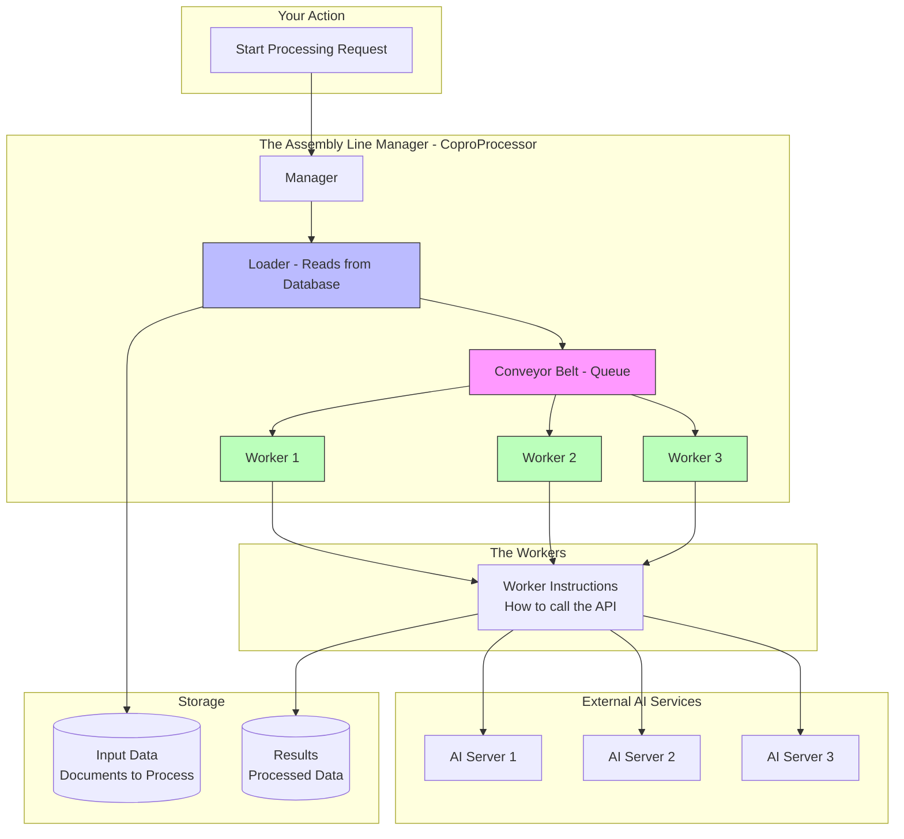
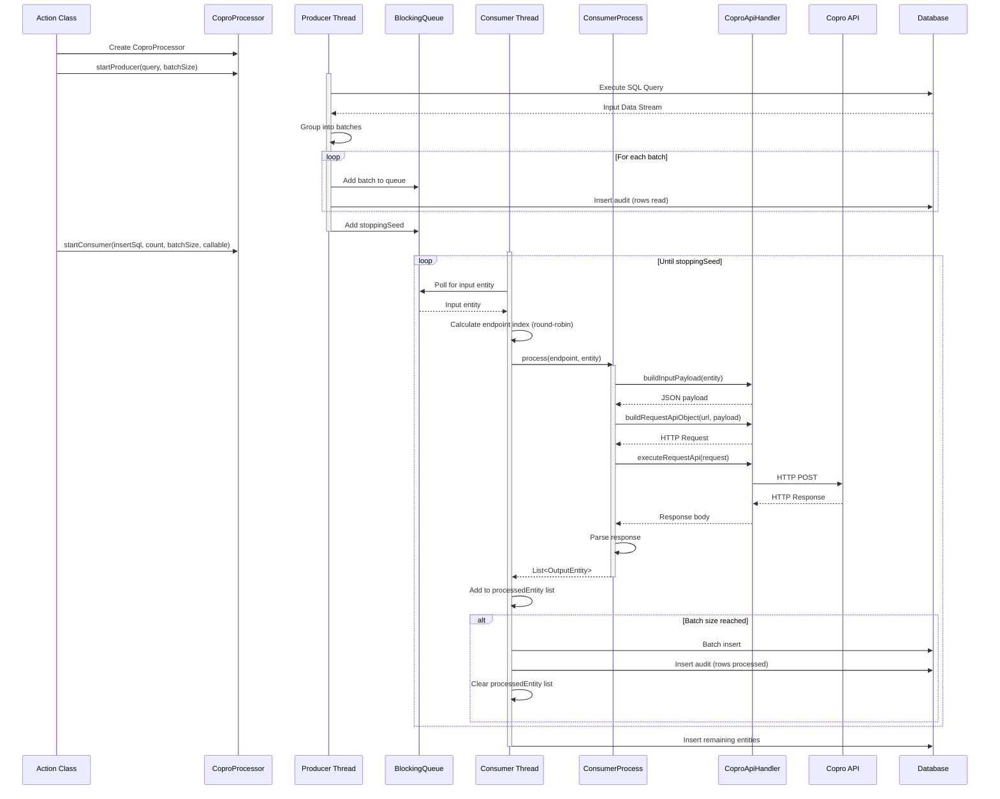

# CoproProcessor Implementation Guide

## What is CoproProcessor?

Think of **CoproProcessor** as an assembly line manager for processing large amounts of data through external AI/ML services (called "Copro APIs"). Just like a factory assembly line has workers taking items from a conveyor belt and processing them, CoproProcessor manages the flow of data from your database through external APIs and back to storage.

### Why Do We Need It?

When you have thousands of documents to process (extract text, detect templates, find tables, etc.), you can't process them one by one - it would take forever. CoproProcessor solves this by:

1. **Reading data in batches** from the database (like loading boxes onto a conveyor belt)
2. **Distributing work** across multiple processing threads (like having multiple workers)
3. **Balancing load** across multiple API servers (like distributing work evenly)
4. **Handling failures** gracefully with automatic retries
5. **Writing results back** to the database in batches

---

## How It Works: The Big Picture


### The Assembly Line Analogy



### The Process in Simple Terms

1. **The Loader (Producer)** reads documents from your database in batches (e.g., 100 at a time)
2. **The Conveyor Belt (Queue)** holds these documents temporarily
3. **The Workers (Consumers)** pick documents from the conveyor belt
4. Each worker sends the document to an **AI Service** (like OCR, template detection, etc.)
5. The worker receives the result and saves it back to the database
6. This continues until all documents are processed

**Key Benefit**: Multiple workers can process different documents at the same time, making everything much faster!

---

## The Main Components Explained

### 1. CoproProcessor - The Manager

This is the main class that coordinates everything. Think of it as the factory manager who:

- Hires workers (creates consumer threads)
- Sets up the conveyor belt (creates the queue)
- Tells the loader what to fetch (configures the producer)
- Monitors the whole operation (auditing and logging)

**What you provide when creating it:**
- Input data structure (what documents look like)
- Output data structure (what results look like)
- Database connection details
- List of AI service URLs (the servers to call)
- Configuration settings (batch sizes, number of workers, etc.)

### 2. The Loader (Producer Thread)

The loader's job is simple:
1. Run your SQL query to get documents that need processing
2. Group them into batches (e.g., 100 documents per batch)
3. Put each batch onto the conveyor belt (queue)
4. When done, put a special "STOP" signal on the belt

**Example**: If you have 1,000 documents and batch size is 100, the loader creates 10 batches and adds them to the queue.

### 3. The Conveyor Belt (BlockingQueue)

This is a special type of queue that:
- Holds batches of documents waiting to be processed
- Automatically waits if it's empty (workers don't waste CPU)
- Thread-safe (multiple workers can safely take from it)

### 4. The Workers (Consumer Threads)

Each worker follows this simple loop:

```
WHILE there are items on the conveyor belt:
    1. Take one document from the belt
    2. Choose which AI server to call (round-robin)
    3. Send the document to that server
    4. Wait for the response
    5. Save the result temporarily
    6. If we have enough results (batch size), write them all to database
    
When the STOP signal appears:
    Write any remaining results to database
    Clock out (thread ends)
```

**Round-Robin Distribution**: If you have 3 AI servers, Worker 1's first call goes to Server 1, Worker 2's first call goes to Server 2, Worker 3's first call goes to Server 3, then it cycles back to Server 1. This spreads the load evenly.

### 5. The Worker Instructions (ConsumerProcess)

This is where YOU define what each worker should do with a document. It's like giving workers a manual:

**Your manual must explain:**
- How to prepare the request (convert document info to JSON)
- How to call the AI service (HTTP POST request)
- How to handle the response (parse the JSON result)
- What to do if something fails (error handling)

### 6. The API Helper (CoproApiHandler)

This is a toolbox that makes API calls easier. It provides ready-made functions for:
- Converting data to JSON
- Building HTTP requests
- Sending requests and getting responses
- Parsing responses back into Java objects

---

## How Data Flows Through the System

Let's follow a single document through the entire process:

### Step-by-Step Journey




**In Simple Terms:**

1. **Setup Phase**: Your action tells the manager to start
   - Manager creates the conveyor belt
   - Manager hires workers
   - Manager tells the loader what data to fetch

2. **Loading Phase**: The loader gets to work
   - Runs a database query to find documents
   - Groups them into batches (like packing boxes)
   - Puts batches on the conveyor belt
   - Puts a "FINISHED" sign when done

3. **Processing Phase**: Workers start processing
   - Each worker grabs a document from the belt
   - Picks an AI server (rotating between available servers)
   - Sends the document to that server
   - Waits for the result
   - Collects results until they have a full batch
   - Writes the batch to the database

4. **API Call**: What happens when a worker calls the AI
   - Worker prepares the document data as JSON
   - Worker sends an HTTP request to the AI server
   - AI server processes the document (extracts text, detects template, etc.)
   - AI server sends back the results as JSON
   - Worker parses the results and creates an output record

5. **Finishing Up**: When all documents are processed
   - Workers write any remaining results to the database
   - Workers record how many documents they processed
   - Workers clock out (threads end)
   - Manager shuts down the assembly line

---

## How to Implement Your Own Copro API Integration

If you need to add a new AI service integration, follow these three steps:

### Step 1: Define Your Data Structures

You need two classes - one for input (what goes in) and one for output (what comes out):

**Input Class** - Describes the documents you want to process:
```java
public class MyInputTable {
    private String documentId;
    private String filePath;
    private String templateType;
    // Add whatever fields your documents have
}
```

**Output Class** - Describes the results you get back:
```java
@Data
@Builder
public class MyOutputTable implements CoproProcessor.Entity {
    private String documentId;
    private String result;
    private String status;  // "COMPLETED" or "FAILED"
    
    @Override
    public List<Object> getRowData() {
        // Return fields in the SAME ORDER as your database INSERT statement
        return Arrays.asList(documentId, result, status, ...);
    }
    
    @Override
    public String getStatus() {
        return status;
    }
}
```

### Step 2: Write the Worker Instructions

This is where you tell workers how to call your specific AI service:

```java
public class MyConsumerProcess 
    implements CoproProcessor.ConsumerProcess<MyInputTable, MyOutputTable> {
    
    @Override
    public List<MyOutputTable> process(URL apiEndpoint, MyInputTable document) {
        List<MyOutputTable> results = new ArrayList<>();
        
        try {
            // 1. Prepare the request
            MyApiRequest request = new MyApiRequest();
            request.setDocumentPath(document.getFilePath());
            String jsonRequest = convertToJson(request);
            
            // 2. Call the AI service
            Response response = callApi(apiEndpoint, jsonRequest);
            
            // 3. Handle the response
            if (response.isSuccessful()) {
                MyApiResponse apiResponse = parseResponse(response);
                
                results.add(MyOutputTable.builder()
                    .documentId(document.getDocumentId())
                    .result(apiResponse.getExtractedData())
                    .status("COMPLETED")
                    .build());
            } else {
                results.add(MyOutputTable.builder()
                    .documentId(document.getDocumentId())
                    .status("FAILED")
                    .build());
            }
        } catch (Exception e) {
            // Always handle errors!
            results.add(MyOutputTable.builder()
                .documentId(document.getDocumentId())
                .status("FAILED")
                .build());
        }
        
        return results;
    }
}
```

### Step 3: Create Your Action Class

This is the main entry point that sets everything up:

```java
@ActionExecution(actionName = "MyAction")
public class MyAction implements IActionExecution {
    
    @Override
    public void execute() throws Exception {
        // 1. Get your configuration
        String apiUrls = "http://server1:8080,http://server2:8080";
        List<URL> endpoints = parseUrls(apiUrls);
        
        // 2. Create the CoproProcessor (the manager)
        CoproProcessor<MyInputTable, MyOutputTable> processor = 
            new CoproProcessor<>(
                new LinkedBlockingQueue<>(),  // The conveyor belt
                MyOutputTable.class,          // Output type
                MyInputTable.class,           // Input type
                "my-database",                // Database connection name
                logger,                       // Logger
                new MyInputTable(),           // Stop signal
                endpoints,                    // List of AI servers
                actionAudit                   // Audit context
            );
        
        // 3. Configure batch sizes and worker count
        int readBatchSize = 100;    // Read 100 documents at a time
        int workerCount = 5;        // Use 5 workers
        int writeBatchSize = 50;    // Write 50 results at a time
        
        // 4. Create your worker instructions
        MyConsumerProcess workerInstructions = new MyConsumerProcess(logger, ...);
        
        // 5. Start the assembly line!
        processor.startProducer("SELECT * FROM documents WHERE status='pending'", readBatchSize);
        Thread.sleep(1000);  // Give the loader a head start
        processor.startConsumer("INSERT INTO results (...) VALUES (...)", 
                               workerCount, writeBatchSize, workerInstructions);
        
        logger.info("All documents processed!");
    }
}
```

---

## Real-World Examples

Here are some actual use cases in the Handyman system:

### Text Extraction from Documents

**What it does**: Reads scanned documents and extracts all the text using OCR

**How it works**:
1. Loader fetches document file paths from database
2. Workers send images to OCR API (supports multiple OCR engines)
3. OCR API returns extracted text
4. Workers save the text back to database
5. System marks blank pages automatically (if text is too short)

**Special features**:
- Can encrypt the extracted text for security
- Supports different OCR models (Argon, Krypton)
- Can send images as Base64 or file paths

### Template Detection

**What it does**: Identifies what type of document it is (invoice, medical form, contract, etc.)

**How it works**:
1. Loader fetches document images
2. Workers send images to classification API
3. API returns template type and confidence score
4. Workers save classification results

### Table Extraction

**What it does**: Finds tables in documents and extracts their data

**How it works**:
1. Loader fetches document pages
2. Workers send pages to table detection API
3. API returns table coordinates and cell data
4. Workers save structured table data

### 40+ Other Use Cases

The same CoproProcessor pattern is used for:
- Handwriting detection
- QR code reading
- Face detection
- Document rotation correction
- Key-value pair extraction
- Named entity recognition
- And many more...

---

## Configuration Made Simple

You control how CoproProcessor works through configuration settings:

### How Many Documents to Read at Once?

```properties
db.select.read.batch.size=100
```
- **Smaller (10-50)**: Uses less memory, but reads from database more often
- **Larger (500-1000)**: Faster, but uses more memory
- **Recommended**: Start with 100

### How Many Workers to Use?

```properties
text.extraction.consumer.API.count=5
```
- **Too few**: Your AI servers sit idle, processing is slow
- **Too many**: Workers compete for resources, no real benefit
- **Recommended**: 2-3 workers per AI server you have

### How Many Results to Write at Once?

```properties
db.insert.write.batch.size=50
```
- **Smaller (10-30)**: Saves to database more frequently (safer)
- **Larger (100-200)**: Faster, but if something crashes you lose more data
- **Recommended**: 50

### Should We Retry Failed Documents?

```properties
copro.processor.retry.failed.files=true
copro.processor.retry.failed.files.max.attempts=3
```
- **true**: If an API call fails, try again up to 3 times
- **false**: If it fails once, mark it as failed and move on
- **Recommended**: true (network issues happen!)

### How Long to Wait for API Response?

```properties
copro.client.socket.timeout=100
```
- This is in **minutes**
- If the AI server doesn't respond within this time, give up
- **Recommended**: 10-30 minutes for heavy processing, 5 minutes for simple tasks

---

## What Can Go Wrong and How to Fix It

### Problem 1: Processing is Very Slow

**Symptoms**: Documents are taking forever to process

**Possible Causes**:
- Not enough workers
- AI servers are slow or overloaded
- Batch sizes are too small

**Solutions**:
- Increase worker count (`text.extraction.consumer.API.count`)
- Check if AI servers are healthy
- Increase read batch size to reduce database queries

### Problem 2: Running Out of Memory

**Symptoms**: Application crashes with "OutOfMemoryError"

**Possible Causes**:
- Reading too many documents at once
- Writing batches are too large
- Too many workers running simultaneously

**Solutions**:
- Reduce `db.select.read.batch.size`
- Reduce `db.insert.write.batch.size`
- Reduce number of workers

### Problem 3: Some AI Servers Get More Work Than Others

**Symptoms**: One server is overloaded while others are idle

**Possible Causes**:
- Round-robin distribution not working
- One server is slower than others

**Solutions**:
- Check that all server URLs are correctly configured
- Remove slow servers from the list
- Monitor server health

### Problem 4: Many Documents Failing

**Symptoms**: Lots of documents marked as "FAILED"

**Possible Causes**:
- AI service is down
- Wrong API format
- Network issues

**Solutions**:
- Check AI service health
- Enable retry mechanism
- Check error logs for specific error messages
- Verify API request format matches what the service expects

---

## Monitoring and Tracking

The system automatically tracks everything in database tables:

### statement_execution_audit Table

This table shows you:
- How many documents were read from database
- How many were processed successfully
- How long each batch took
- Which action/step it was

**Use this to**: Monitor progress and identify slow steps

### failed_copro_process Table

This table stores:
- Documents that failed to process
- The error message
- The request that was sent
- The response (if any)
- How many times it was retried

**Use this to**: Debug why certain documents fail

### resource_utilization_details Table

This table tracks:
- When AI services were started/stopped
- CPU, GPU, RAM usage
- Process IDs

**Use this to**: Monitor resource consumption and costs

---

## Key Takeaways

1. **CoproProcessor is like an assembly line manager** - it coordinates the flow of data through external AI services

2. **It handles the hard parts for you**:
   - Reading data in batches
   - Managing multiple workers
   - Distributing load across servers
   - Retrying failures
   - Writing results back

3. **You only need to provide three things**:
   - Input/output data structures
   - Instructions for calling your specific AI service
   - Configuration settings

4. **It's battle-tested** - used in 40+ different AI integrations in production

5. **It's configurable** - adjust batch sizes, worker counts, and retry behavior to match your needs

6. **It's observable** - comprehensive logging and database tracking of everything that happens

This pattern makes it easy to add new AI service integrations without reinventing the wheel each time!


## Technical Details (For Reference)

### Core Java Classes

If you need to dive into the code, here are the main classes:

**`CoproProcessor.java`** (`in.handyman.raven.lib.CoproProcessor`)
- The main orchestrator class
- Methods: `startProducer()`, `startConsumer()`, `startConsumerLegacy()`, `startConsumerModern()`
- Interfaces: `ConsumerProcess<I, O>`, `Entity`

**`InboundBatchDataConsumer.java`** (`in.handyman.raven.lib.interfaces.coproprocessor.InboundBatchDataConsumer`)
- Implements the worker logic
- Handles queue polling, API calls, batching, and retries

**`CoproApiHandler.java`** (`in.handyman.raven.lib.handlers.CoproApiHandler`)
- Utility methods for HTTP API calls
- Methods: `buildInputPayload()`, `buildRequestApiObject()`, `executeRequestApi()`, `processResponseBody()`

**`CoproStartAction.java` / `CoproStopAction.java`**
- Lifecycle management for Copro services
- Start/stop AI service containers
- Track resource utilization

### Configuration Reference

All settings are passed through `ActionExecutionAudit.getContext()`:

| Setting | Purpose | Example Value |
|---------|---------|---------------|
| `db.select.read.batch.size` | Documents to read per batch | `100` |
| `db.insert.write.batch.size` | Results to write per batch | `50` |
| `text.extraction.consumer.API.count` | Number of worker threads | `5` |
| `copro.processor.consumer.route.type` | Execution mode | `MODERN` or `LEGACY` |
| `copro.processor.thread.creator` | Thread pool type | `FIXED_THREAD` or `WORK_STEALING` |
| `copro.client.socket.timeout` | API timeout (minutes) | `100` |
| `copro.processor.retry.failed.files` | Enable retries | `true` or `false` |
| `copro.processor.retry.failed.files.max.attempts` | Max retry attempts | `3` |
| `copro.request.text.extraction.handler.name` | API handler type | `COPRO`, `TRITON`, or `REPLICATE` |
| `copro.api.file.input.format` | File format | `BASE64` or `FILE_PATH` |
| `encrypt.request.response` | Encrypt payloads | `true` or `false` |

---

## Summary

The **CoproProcessor** is a production-ready framework that makes it easy to integrate external AI/ML services into your document processing pipeline. It handles all the complex parts of parallel processing, load balancing, error handling, and monitoring, so you can focus on implementing your specific business logic.

**Key Benefits**:
- ✅ **Simple to use** - Just define your data structures and API call logic
- ✅ **Scalable** - Automatically distributes work across multiple servers and threads
- ✅ **Reliable** - Built-in retry mechanism and comprehensive error handling
- ✅ **Observable** - Full audit trail of all processing activities
- ✅ **Battle-tested** - Used in 40+ production integrations

**When to Use**:
- Processing large batches of documents through external APIs
- Need to distribute load across multiple API servers
- Want automatic retry for failed API calls
- Need comprehensive audit trails
- Want to avoid writing boilerplate multi-threading code

**Integration Effort**:
- Define 2 classes (input/output structures)
- Implement 1 method (how to call your API)
- Configure settings (batch sizes, worker counts)
- Total: ~200-300 lines of code for a complete integration

This architecture has proven itself across dozens of AI service integrations in the Handyman framework, from OCR and template detection to table extraction and entity recognition.

